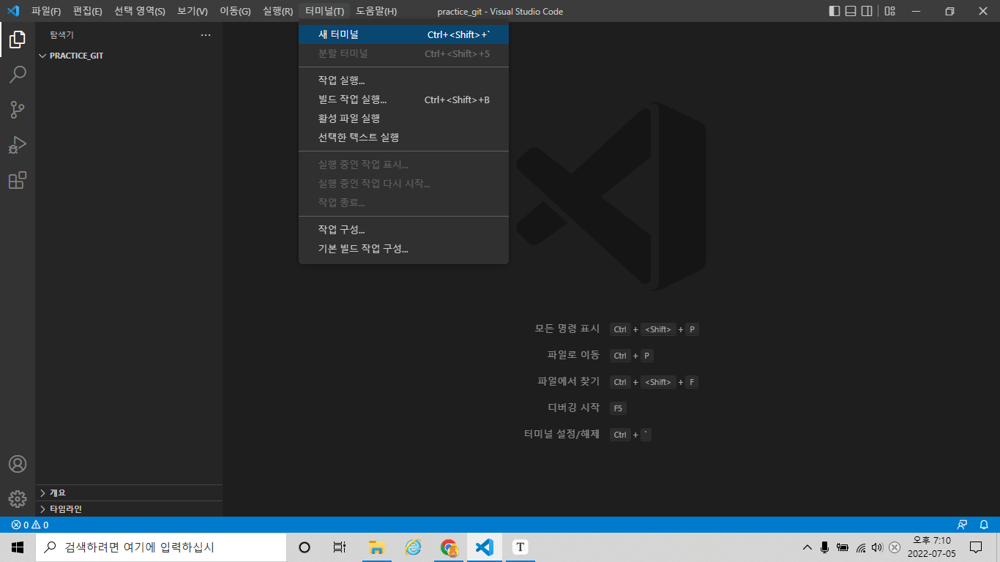
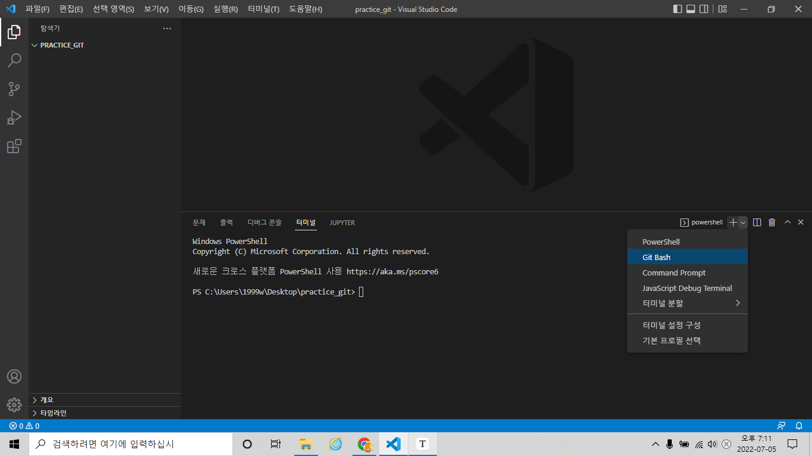
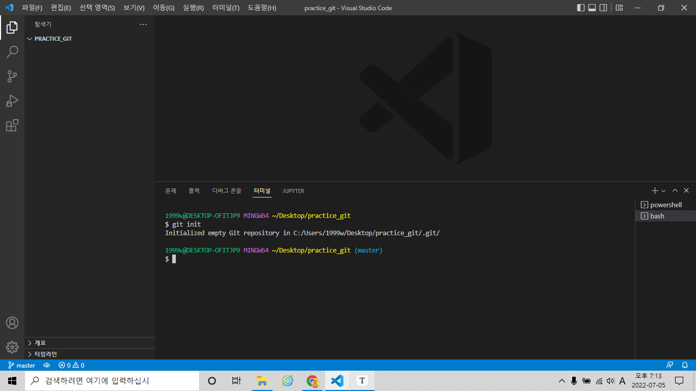

# Git

- git bash 꺼멓고 빨간 글씨..cmd창? = CLI(Command Line Interface)  

- 명령을 줄단위로 조작해요  

- 윈도우 환경 = GUI(Graphic User Interface)  

- 프로젝트 버전관리 = 형상관리 도구  

- 분산 버전 관리 시스템 입니다.  
- 꾸준하게 잔디를 심는것이 나의 성실함의 척도입니다.  

## 1. CLI 기초 명령어

- pwd(print working directory)  : 현재 디렉토리 출력  
- cd(change directory) : (하위)디렉토리 이동  
- cd .. : 상위 디렉토리 이동  
- ls(list) : 목록  
- mkdir : 디렉토리 생성  
- touch : 파일 생성  
- rm(remove) : 삭제  
- rm -r (file_name) : 내용이 있는 폴더 삭제  
- ctrl + l , clear : 상위 라인 지우기(어지러우니까)  
- 로그나 리스트에서 나가려면 Q
- 이전에 실행했던 명령어 사용하려면 ctrl + ↑

## 2. git 기초 명령어

- git init  
  - git의 기초환경, 저장소를 만들어줍니다.  
  - 경로 뒤에 (master)가 붙으면 성공  
  - 상위폴더에 .git(init폴더)이 존재할 시 오류가 납니다.  
    - 위와 같은 이유로 오류가 나면 상위폴더의 숨겨진 폴더 보기를 체크하고 파일을 삭제해줍시다.  
      - 하지만 우리는 마우스 따위 쓰지 않아요 ``
      - CLI명령어 중에 내용이 있는 폴더 삭제 명령어가 있었죠?
    - 보통은 경로 뒤에 (master)가 디폴트 상태인데 혹시 (main)으로 변경할 일이 있다면   
      `git config --global init.defaultBranch main`  
    - 혹은 경로 뒤에 브랜치 이름이 이상하다!   
      - `git branch`로 브랜치 확인  
      - `git branch <변경할이름>`  
      - `git checkout <변경할이름> ` 
      - `git branch`로 이전 브랜치 확인  
      - `git branch -d <삭제할이름>`  

- 사용자계정설정  

  - add했는데 Who are you를 묻네요.  

  - `git config --global user.email 'email@site'`  
  - `git config --global user.name 'username' ` 
  - 이것을 잘못 입력하면 잔디가 제대로 심기지 않을 수 있습니다.  
  - 혹시 잘못 입력한것 같다면 `git config --list`에서 확인할 수 있습니다.  
    - 삭제방법  
      - `git config --unset --global user.name ` 
      - `git config --unset --global user.email ` 
      - `git config --list`로 확인합니다.  

- `git status ` 

  - 현재 파일들의 상태를 확인합니다.  
  - commit되지 않은파일, 수정(modify)된 파일 등의 작업 트리의 파일 존재유무를 확인합니다.  
  - 모든 작업이 끝난 후 매번 작업트리가 비었는지 확인합니다  

- `git log ` 

  - 커밋한 파일들의 로그를 가져옵니다.  
  - git log -1 (커밋된 로그 중에 가장 최근의 1개를 가져옵니다.)  
  - git log --oneline(커밋된 로그를 1줄로 표시합니다.)  
  - git log -1 --oneline으로 조합해서 사용할 수 있습니다.  

- `git add <파일이름>  ` 

  - 반드시 저장 후 add
  - 저장된 파일을 staging area로 보냅니다.  
    - 이유를 알 수 없는 모호한 구문오류  
      - bash: syntax error near unexpected token ')'  
      - 대체방법으로 `git add "filename"`을 사용했습니다. stackoverflow에서 비슷한 사례를 찾아보니  ")"괄호가 많거나 적어서 일어난다는데 대체 괄호가 어디있다는거죠.  
        - (추가) Inflearn이라는 다른 개발자 커뮤니티에서 이유를 알아냈습니다. 컴파일러님이 괄호가 헷갈리신답니다. 참내( '^' ) [링크참조](https://www.inflearn.com/questions/37096)  
        - 난 바보다!! 괄호 안에 파일명을 넣는게 아니었어!!!

- `git commit -m '메세지를입력하세요'`  
  - staging area에 있는 파일을 커밋합니다.  
  - 커밋할때는 반드시 추가, 변경사항을 표기하여 커밋합니다.  
  - 커밋한 내용을 삭제하기  
    -  `git reset HEAD~숫자` 최근 (숫자)만큼의 내역을 삭제합니다.   
  
- error massage의 해석  

``` bash
$ git status
On branch master

# 트래킹이 되고 있지 않은 파일?
# => 1통 (working directory)
# => 한번도 git으로 관리되고 있지 않은 파일
Untracked files:
# git add 사용해봐..
# 포함시키기 위해서 / 커밋이 될 것 => 2통에 넣으려면
	(use 'git add <file>...' to include in what will ve comitted)
			a. txt
			
# 커밋할 것은 없어 => 2통이 비어있어
# 하지만 트래킹되지 않은 파일은 존재한다.
# (git add 사용해서 트래킹해)
nothing added to commit vut untracked files present (use "git add to track")
```

## 3. vs환경에서의 git 작업 과정

1. vs를 실행하고, 작업파일이 있는 폴더를 엽니다.  

2. 터미널을 실행합니다.  
   

3. Git bash를 실행합니다.  
   
   
4. git 저장소를 만듭니다.`git init`  
   

5. 사용자계정을 지정해줍니다.  

   ``` bash
   git config --global user.email 'email@site'
   git config --global user.name 'username'
   ```

6. 작업파일을 add해줍니다 `git add <filename>`    

8. 커밋 `git -m '깃연습테스터1' `   

9. 상태를 확인합니다.   

9. branch name 확인, git init에 설정된 branch name이 원격저장소(remote repository, a.k.a github)의 branch name과 같은지 확인합니다.  

   1. (다르게 사용하는건 현업에서 작업단위가 나눠질때 사용해요.)[참조 ](https://backlog.com/git-tutorial/kr/stepup/stepup1_1.html)  

10. `git remote add origin (url)`깃아 원격저장소에 연결해줘 origin으로 (원격저장소 url)에  

    1. 여기서 origin은 remote repository의 별칭입니다. url을 쓰긴 귀찮으니까요. 
    2. 연결된 저장소 정보 조회 `git remote show 'origin'`   
    2. 으악 잘못 연결했다! 혹은 연결된 repository를 바꾸고싶으면 삭제했다 다시 연결합시다.`git remote remove origin`  
    
11. `git push origin master`  

    - `push`전에 add, push 깜빡하는 경우가 많아요. 반드시 확인합시다.  

12. 깃헙에 잘 올라갔는지 확인합니다. 끝~!  
